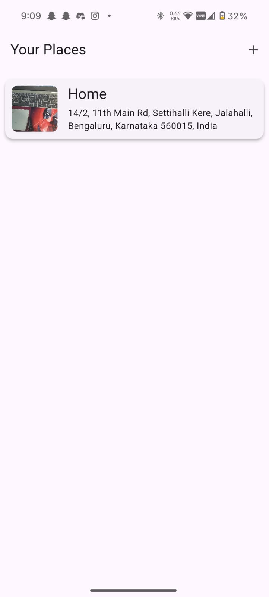
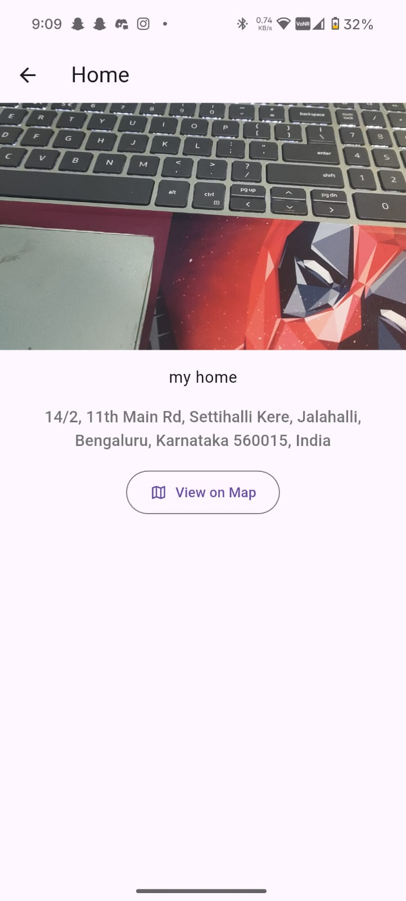

### Your Places - A Personal Places Journal

"Your Places" is a mobile application built with Flutter that allows users to create a personal journal of their favorite locations. Users can add new places by capturing an image, adding a title and description, and saving the precise location using their device's GPS or by selecting it manually from a map.

All data is stored locally on the device, ensuring user privacy and offline accessibility.

## Features

View All Places: A clean home screen that lists all your saved places with a preview image, title, and address.

Add New Place: An intuitive form to add a new location.

Title & Description: Add a custom title and description for your place.

Image Capture: Use the native device camera to take a new photo for the place.

Location Picking:

Get the current GPS location with a single tap.

Manually select any location from an interactive map (using Maps API).

View Place Details: Tap on a place to see its details, including the full image and address.

View on Map: Open the saved coordinates directly in a map view to see exactly where the place is located.

## Core Technologies Used

This project highlights the use of several key technologies for modern Flutter development:

Provider: Utilized for efficient and simple state management, allowing different parts of the app to react to changes in the data (like adding a new place) without complex boilerplate.

SQLite (via sqflite package): Implemented for robust and persistent local storage. All places added by the user are saved directly to an on-device SQL database, making the data available even when offline.

Maps API (via Maps_flutter or similar): Integrated to provide rich map functionalities, including picking a location from a map and displaying a saved location's static or interactive map.

Native Camera (via image_picker package): Leverages the device's native camera hardware to capture and save images directly within the app.

## Screenshots

Home Screen

Add Place Screen

Place Details

(Note: Images are referenced locally in this example. You may need to adjust paths or embed them directly in your repository's README.)

## Getting Started

To get a local copy up and running, follow these simple steps.

Prerequisites

Flutter SDK (e.g., 3.x.x)

An emulator or a physical device

API Key for the Maps API (configured for Android/iOS)

Installation

Clone the repo

git clone [https://github.com/your-username/your-places-app.git](https://github.com/your-username/your-places-app.git)

Install packages

flutter pub get

Configure API Keys

Add your Google Maps API key to android/app/src/main/AndroidManifest.xml (for Android).

Add your Google Maps API key to ios/Runner/AppDelegate.swift (for iOS).

Run the app

flutter run

## Contributing

Contributions are what make the open-source community such an amazing place to learn, inspire, and create. Any contributions you make are greatly appreciated.

Fork the Project

Create your Feature Branch (git checkout -b feature/AmazingFeature)

Commit your Changes (git commit -m 'Add some AmazingFeature')

Push to the Branch (git push origin feature/AmazingFeature)

Open a Pull Request